<a href="https://saisiri-bandaru.github.io">
  <picture>
    <source media="(prefers-color-scheme: dark)" srcset="./dark.svg">
    
  </picture>
</a>

 

**Financial Analyst · FP&A · Operations Finance**  
PNC Financial Services · M.S. Business Analytics (University of New Haven) · MBA, Accounting & Finance

I sit between operations and the P&L. I build variance packs, driver-based forecasts, cash views, and capital cases that a leader can use in the meeting — not a week later.

[Portfolio](https://saisiri-bandaru.github.io) · [LinkedIn](https://www.linkedin.com/in/bandarusaisiri) · [bandarusaisiri1207@gmail.com](mailto:bandarusaisiri1207@gmail.com)

---

## Recruiter path — 8 minutes

1. Skim the [portfolio](https://saisiri-bandaru.github.io) for experience and the quantified record.
2. Open **one** workbook below. Yellow cells with blue font are inputs. Black font is formulas.
3. Change a driver. The output tab should move with it.

All sample numbers are for a fictional company (**Northline Consumer Products**). No employer data is in these files.

---

## Open these four

| # | Model | Question a hiring manager can test | File |
| --- | --- | --- | --- |
| 1 | [FP&A variance dashboard](https://github.com/saisiri-bandaru/fpna-variance-dashboard) | Why did margin miss — rate or volume? | `Northline_FPNA_Variance_Dashboard_FY2026.xlsx` |
| 2 | [Cost accounting workbook](https://github.com/saisiri-bandaru/cost-accounting-workbook) | Does the plant variance sit with purchasing or the floor? | `Northline_Cost_Accounting_Variances_Jul2026.xlsx` |
| 3 | [13-week cash forecast](https://github.com/saisiri-bandaru/thirteen-week-cash-forecast) | Can payroll and vendors clear if receipts slip one week? | `Northline_13_Week_Cash_Forecast.xlsx` |
| 4 | [Driver-based forecast](https://github.com/saisiri-bandaru/driver-based-forecast) | If volume or cost moves, what happens to the P&L vs plan? | `Northline_Driver_Based_Forecast.xlsx` |

More models (three-statement, DCF, capex, working capital, headcount, KPI)

 

| Model | What it proves |
| --- | --- |
| [Three-statement model](https://github.com/saisiri-bandaru/three-statement-model) | P&L, balance sheet, and cash flow stay tied when a driver moves |
| [DCF valuation](https://github.com/saisiri-bandaru/dcf-valuation-model) | Unlevered FCF, WACC, terminal value, NPV and IRR on a capital ask |
| [Capex investment case](https://github.com/saisiri-bandaru/capex-investment-case) | Project cash flows with NPV, IRR, payback, and a one-pager |
| [Working capital dashboard](https://github.com/saisiri-bandaru/working-capital-dashboard) | AR/AP aging, inventory days, cash conversion cycle |
| [Headcount staffing forecast](https://github.com/saisiri-bandaru/headcount-staffing-forecast) | 12-month headcount and loaded-cost plan vs reforecast |
| [Monthly KPI scorecard](https://github.com/saisiri-bandaru/monthly-kpi-scorecard) | Ops and finance KPIs with targets, variances, RAG |

---

## What I am hired to do

- Monthly close: Actual vs Budget vs Forecast, commentary, and a rate-vs-volume split
- Operations finance: unit cost, throughput, and staffing reforecasts operators can run the week on
- Cash and working capital: 13-week receipts / disbursements and cash-conversion diagnostics
- Capital: NPV / IRR packs that survive a challenge from finance leadership

**Recent signal:** supported a **2% throughput lift** at PNC through process and unit-cost work. Full experience and toolkit live on the [portfolio](https://saisiri-bandaru.github.io).

---

## How the workbooks are built

- One fictional company across files so the story is consistent
- Cover tab + data dictionary so another analyst can inherit the file
- Excel formulas only — no VBA, no live ERP extracts, no confidential figures
- Built for a screen-share: change the yellow cell, read the dashboard

**Shown here:** Advanced Excel models used in FP&A and operations finance.  
**Used on the job (see portfolio):** Power BI · Tableau · SQL · NetSuite · SAP / Oracle

---

## Contact

- Email: [bandarusaisiri1207@gmail.com](mailto:bandarusaisiri1207@gmail.com)
- Phone: [203.533.9355](tel:+12035339355)
- LinkedIn: [linkedin.com/in/bandarusaisiri](https://www.linkedin.com/in/bandarusaisiri)
- Portfolio: [saisiri-bandaru.github.io](https://saisiri-bandaru.github.io)
